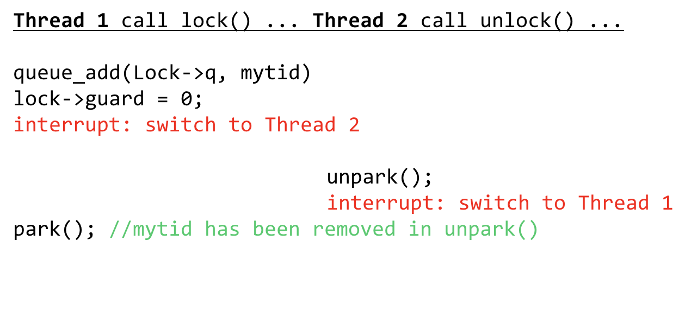

# 3.15 Lock

## Lock

是简化版的「信号量」。是最大值仅为 1 的信号量。是状态只能在 0、1 之间切换的信号量。

### API

```c
pthread_mutex_t lock = PTHREAD_MUTEX_INITIALIZER;
// or:
int rc = pthread_mutex_init(&lock, NULL);

pthread_mutex_lock(&lock);
balance = balance + 1;
pthread_mutex_unlock(&lock);
```

`mutex` 一般特指 Lock，因为它就是 **Mut**ual **Ex**clusion 的简称。

除了 P/V 以外，还有两个函数可用：

```c
int pthread_mutex_trylock(pthread_mutex_t *mutex);
int pthread_mutex_timedlock(pthread_mutex_t *mutex,
			         struct timespec *abs_timeout);
```

`trylock` 在 `mutex` 空闲的时候获取锁，并且返回「Set!」标识；如果 `mutex` 当前被占用，那么不等了立即返回「Occupied!」标识。

`timedlock` 呢，就是尝试一段时间拿锁；如果没拿到再返回。

都是很简朴的语法。

### Evaluating a Lock

如何衡量「锁」的好坏？这里有一些通用的判定要素：

* Fairness

公平吗？即，是否可能出现「大家同样是等，但是有的人特别倒霉，一直排不上号」的情况？

* Performance

对性能的影响大吗？即，如果我一个双核系统用了你的锁算法，结果居然比单核跑还慢了，那这肯定不能是一个好的锁算法。

* Effective

有效吗？这里一般特指：资源空闲、且有人请求的情况下，能否保证一定有人能得到资源，而非所有人空耗，空置资源。

### Various Locks

#### Hardware Lock

在单核心的时代，大家都是这么防止其他进程插入自己的执行流的：

```c
void lock() {
    DisableInterrupts();
}

void unlock() {
    EnableInterrupts(); 
}
```

众所周知，进程上下文的切换就是通过中断实现的。所以关闭了中断，意味着不会有人能夺走我的控制权。

> POSIX 下，用 `Sigprocmask` 可以达成这一目的。

这在多核心情况下显然是不可以的。即使不出现中断，也可能有其他核心运行的进程和你发生竞险。

另外，把「开关中断」这么重大的事宜交给用户代码负责，这本身就很不安全。如果某个用户态 App 忘了放锁，整个 OS Kernel 就全宕了。

> 不能这么干。

#### Simple (but wrong)

来看一个最简单的想法：

```c
typedef struct __lock_t {
    // 0 -> lock is available
    // 1 -> lock is held
    int flag;
} lock_t;

void init(lock_t *mutex) {
    mutex->flag = 0;
}
```

> C 语法的限制，导致大家几乎必须用 `typedef` 来自定义 `struct`…

然后，拿锁、放锁的代码这么写：

```c
void lock(lock_t *mutex) {
    while (mutex->flag == 1);
    mutex->flag = 1;
}

void unlock() {
    mutex->flag = 0;
}
```

放锁的代码肯定是 OK 的；因为（正常情况下）只会有一个进程持有锁，不会在这里造成竞险。

拿锁呢？看起来好像很正常；在 `mutex->flag` 被占有时，就死循环；循环跳出後，再拿锁。

遗憾的是，这是行不通的。究其原因是：「检查 `mutex->flag`」和「设置 `mutex->flag`」这两件事不是原子的。

换句话说，可能有两位试图拿锁的人同时阻塞等待，并且双方同时从 `while(mutex->flag == 1)` 中跳出，从而都认为自己持有了锁。

就算不考虑这个问题，不断的 Spinning 也会带来巨大的效能问题。

#### Hardware Support

关键在于，要把「Get」和「Set」两件事做成原子的，即中途不被打断，就能做到。

例如，SPARC 平台下的 `ldstub`、`x86` 下的 `xchg`，都是做类似的事情。

理论上只要有这样的一个原子操作（Test & Set），就能实现锁了。

```c
atomic int test_and_set(int *old_ptr, int new) {
    int old = *old_ptr;
    *old_ptr = new;
    return old;
}
```

```c
void lock(lock_t *lock) {
   while (TestAndSet(&lock->flag, 1) == 1)
      ; // spin-wait (do nothing)
}
```

`TestAndSet(<addr>, b) == a` 检查的是「我是否真的把该内存地址做了一次从 `a` 到 `b` 的转换」。

这样写有点不直观，我们可以换成等价的形式：

```c
void lock(lock_t *lock) {
   while (1) {
       // 如果我成功把 lock->flag 从 0 切换成了 1（这件事在没有 unlock 的情况下不可能被做两次）
       if (TestAndSet(&lock->flag, 1) == 0) {
           // 那我就拿到锁了
           return;
       }
   }
}
```

#### T & S

或许会想，难道没有纯软件可以实现的方法吗？

答案是有的。

例如，这就是一个机遇 Test & Set 的软件实现：

```c
typedef struct __lock_t {
    int flag;
} lock_t;
int flag[N]; //one flag per thread

int AnyoneElseInerested(int me)
{ //is another thread updating Lock?
    for (i = 0; i < N; i++)
        if (i != me && flag[i] == 1)
            return 1;
    return 0;
}

int TestAndSet(lock_t Lock)
{ //set lock and return old value
    int ret;
    while (1) { //me is my index in flag
        flag[me] = 1; //warn other threads
        if (AnyoneElseInterested(me)) //is other thread warning us
            flag[me] = 0; //yes, reset my warning, try again
        else {
            ret = Lock.flag; //set ret to value of Lock
            Lock.flag = 1; //and set the Lock
            flag[me] = 0;
            return ret;
        }
    }
}
```

它基于「能请求资源的线程数量有限」这一假定，通过一个全局数组记录请求来决定锁的授权。

注意他的效率是很低的；因为要求只有在其他任何线程都不请求锁（`AnyoneElseInterested` 为假）时才能拿到锁。事实上，这可能会带来 Livelock 问题——两个进程几乎同时进入拿锁函数，同时设置 `flag[me] = 1`，同时在 `AnyoneElseInterested(me)` 中碰壁，然后同时又设置回 `flag[me] = 0` 返回。

他也不公平；可能有倒霉进程一直等，一直拿不到锁。

#### C & S

Compare and Swap。比较并交换。

> 也有 Compare & Exchange 的叫法。

这也是一个原子指令，用 C 表示大概像这样：

```c
atomic int compare_and_swap(int* ptr, int expected, int new)
{
    int actual = *ptr;
    if (actual == expected)
        *ptr = new;
    return actual;
}
```

也就是，只在 `*ptr` 是 `expected` 的时候才将其设置为 `new`。

这样 `lock()` 函数就可以这么写：

```c
void lock(lock_t *lock) {
    while (CompareAndSwap(&lock->flag, 0, 1) == 1)
        ; // spin
}
```

「只有做了 0 -> 1 的变换时，才是拿到了这个锁」。这和 T & S 的描述其实是一样的。

#### Ticket Lock

票式锁。特点是同时具有「公平性」和「有效性」的。

下面展示一个给予 `Fetch and Add` 原子操作的 Ticket Lock 实现：

```c
atomic int fetch_and_add(int *ptr) {
   int old = *ptr;  // fetch old value at ptr
   *ptr = old + 1;  // add 1 and store ‘new’ into ptr
   return old;      // return the old value
}
```

放锁的过程是「根据记录表（数组也好，链表也好）找到下一个该拿锁的人，并且将其等待状态设定为 OK」。

因为「放锁」时如果有人正在等待，那么所有权就直接交给了他，不存在「空悬」。

又因为只要拿到了号码，就一定可以期待在将来某时刻获取资源；也不存在饿死问题。

因为不存在一个全局变量保存「锁的状态」，因此数据竞险问题就缓解了很多。

唯一的竞险问题就是「锁空悬」的状态下，多个人同时请求 Ticket 可能产生竞险问题。所以 FetchAndAdd 就是用在这里的。

```c
typedef struct __lock_t { 
  int ticket;
  int turn;
} lock_t;

void init (lock_t *lock) {
   lock->ticket = 0;
   lock->turn   = 0;
}

void lock (lock_t *lock) {
   int myturn = FetchAndAdd(&lock->ticket);
   while (lock->turn != myturn) 
      ; // spin
}

void unlock(lock_t *lock) {
    lock->turn = lock->turn + 1;
}
```

干净的解法。

### Avoid Spinning

不管是用哪一种 Lock 的实现，只要是提供 `lock() await` 的实现，就势必会有拿不到锁的人的 Spinning。这很不好，占用了大量的 CPU 资源。

有没有什么解决办法？

#### `sleep` for a little while

```c
void lock (lock_t *lock) {
   int myturn = FetchAndAdd(&lock->ticket);
   while (lock->turn != myturn) 
      sleep(1); // spin
}
```

视操作系统的实现而定，`sleep` 可能会在将来的一段时间内不去调度这个线程。这样就可以不让等待浪费太多 CPU 时间。

问题就是，拿锁可能出现延迟；就算资源现在马上空闲，你可能也得等上一次 `sleep` 才能拿到。

#### `yield` up

`yield` 就更靠谱一些：会直接放弃**本次**调度权，告知 CPU 另请高明。（注意只是本次，下一次可能还是会被调度到）

但是问题仍然是存在的：假设当前系统中有 100 个进程在等锁、和 1 个进程拿着锁。那么在 OS 进行调度时，很大可能就是在这 100 个进程之间调度去、收到 `yield` 消息、又调度走。浪费了大量的上下文切换时间。

当然，OS 可能会根据其表现来调整其优先级，但这并不能从根本上解决问题。

#### with a `queue`

让进程可以自由管理等待队列。

用 `Park()` 来让某个进程陷入睡眠状态、且不会被调度到。

直到另一个进程使用 `Unpark(threadID)` 将其叫醒。

基于下面的事实：

* 如果我在一个 Ticket Lock 系统中排队等锁，那么我可以确认在前面进程正常释放锁的情况下，一定会在有限的次数内落到我头上。即，一定会存在一个前序进程叫醒我。因此，我可以放心地 `Park()` 自己。
* 作为资源的持有者，我只需要通过检查 Ticket List 就可以知道自己後面是否存在等待着的进程（？）。

不过我们先来看看下面的这些实现：

#### Minor Issues

```c
typedef struct __lock_t { 
	int flag;
	int guard;
	queue_t *q;
} lock_t;

void lock_init (lock_t *lock) {
	lock->flag  = 0;
	lock->guard = 0;
	queue_init(lock->q);
}

void lock (lock_t *lock) {
	while (TestAndSet(&lock->guard, 1) == 1) 
		; // acquire guard lock by spinning
	if (lock->flag == 0) {
		lock->flag = 1; // lock is acquired
		lock->guard = 0;
	} else {
		queue_add(lock->q, gettid());
		park(); 			// !!!
		lock->guard = 0;	// !!!
	}
} 
```

注意带有 `!` 标记的那两行。`park()` 之后程序的执行流就中断了，直到被 `unpark`。所以 `lock->guard` 并没有在自己陷入等待前释放 Ticket 读写锁 `guard`。这样就死锁了。

总之记住，在睡眠之前，确保你没有持有任何资源。否则，睡眠的你无法将他们释放，而活着的就可能会等待那一个睡着的！这是不合理的。

```c
{		
    {
        ...
		queue_add(lock->q, gettid());
		lock->guard = 0;
		park();
        ...
	}
}
```

看起来圆满了。但是考虑下面的执行路径：



简单点说，如果在某个进程设置好等待队列之後、`park()` 好之前，它的前序进程就交出了资源、发送 `unpark()`，会怎么样？

结果很有可能是 `unpark()` 白發了！根据 OS 的实现而定，但是大部分都不会将「发给未 `park()` 的进程的 `unpark()`」缓存起来，而是会直接将其抛弃掉（当作是意外发送的）。结果就是，Thread 1 放心地 `park()` 掉自己，但是之後不会再有任何 `unpark` 叫醒他——因为已经来过了！

所以那些采用 `park()` 的机器又加入了「缓冲区」机制：`setpark()`。在调用这个函数之後，所有发来的 `unpark()` 请求都会被暂存起来，并且如果 `park()` 调用时缓冲区不为空，那么就立即返回。

这样，只要我们在释放 `lock->guard` 锁之前先调用 `setpark()`（因为没有 `lock->guard` 锁，前序进程也没办法 `unpark` 我），就完美解决了这个问题。

```c
void lock (lock_t *lock) {
    while (TestAndSet(&lock->guard, 1) == 1) 
        ; // acquire guard lock by spinning
    if (lock->flag == 0) {
		lock->flag = 1; // lock is acquired
		lock->guard = 0;
	} else {
		queue_add(lock->q, gettid());
		setpark();
		lock->guard = 0;
		park();
	}
}
```

希望你喜欢。

## Cross Platform

毫无疑问，这些「基于特定硬件支持」的解决方案都不可移植。

### Linux

Linux 下提供了一套 `futex`：使用 `futex_wait(addr, expect_value)` 和 `futex_wake(addr)` 来实现类似于 Park 的效果。

具体的用法是：

* `futex_wait(addr, expect_value)` 会在 `*addr` 等于 `expect_value` 时挂起当前进程，并且一直等到 `futex_wake(addr)` 被调用。
* `futex_wake(addr)` 会把当前正在 `futex_wait` 这一内存地址的进程唤醒。

就很类似于 `park` 和 `unpark`，只不过是借助内存空间来作为唤醒 ID；另外还给 `futex_wait` 加上了 `compare` 原子语义，这样就可以避免 `setpark()` 这种东西了。

当然，这也只是表面上可移植。跑在不同机器上的 Linux 在实现 `futex` 时执行的当然是不同的代码。

### C++

如果写 C++ 想要实现原子性，标准库已经提供了非常不错的 `std::atomic`。通常来说这比手动加互斥量保护要方便、而且更快（有一些原子操作是无需互斥量保护就可以实现的）。

除了原子的内存操作，它还可以生成语句栅栏（Barrier），防止 `std::atomic` 两侧的语句被乱序发射执行 CPU 交错执行。

如果需要互斥量，`std::mutex` 当然也 OK。不同平台的 STL 实现可能还有差异，从而实现最佳化的性能。