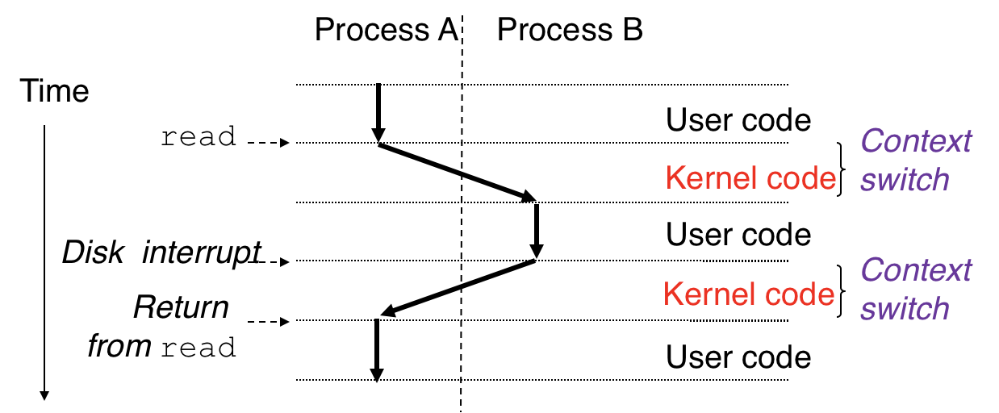
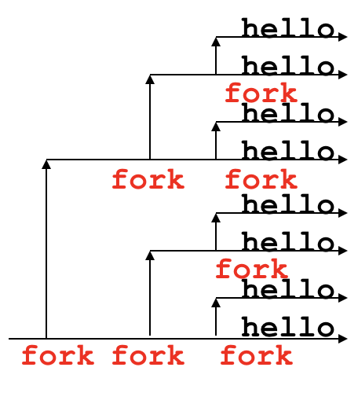

# 3.2 Process

## Outline

* Processes
* Context Switch
* Concurrency
* System Call Error Handling
* Exiting & Creating Processes

## Textbook

* 8.2
* 8.3
* 8.4.1
* 8.4.2

## Process

### Intro

众所周知，Process 是「独立任务」的抽象。

> 用户可以通过 Shell 命令（或点击图标等等方式）创建进程。
>
> 程序代码也可以通过 `spawn`（`fork`）系统调用来创建进程。
>
> 还有，程序代码可能会自行退出，销毁进程。

看起来其乐融融的。但是不要忘记，实际上这是一层运行在 CPU 上的抽象。


在 CPU 看来，大家只不过是一条条平等的执行的指令。那么这层抽象是如何构建的呢？

### Context

先不论别的，OS 必然需要维护每个进程的基本信息（否则就无法进行管理）。数据至少要包括：

* 通用寄存器的值
* 状态寄存器的值
* 页表头的地址

> 把他们统称为「上下文」。

即，在两个进程之间切换的时候，必然需要保证「寄存器」、「页表」的内容协同连贯；否则其执行过程就和单一执行流下的状况不同（就完蛋了！）。

另外，不能允许任何进程在「不经由 OS Kernel」的情况下进行进程相关的东西（不能涉及到下层抽象）。所以，进程 A 和 B 之间的上下文切换要经过这样的过程：



因此在系统中进程的运行，大概是长这样的：


> 你来一下，我来一下。大家都以为自己独占了 CPU，实际上都是错觉。
>
> 注意每一次切换都不是免费的——上下文的储存和恢复都要花钱。

### Switch

每隔一段时间，OS 都会收到来自系统时钟的一个信号打断当前代码的执行，并跳到高异常等级模式；这被视为是一次上下文切换的机会。在完成当前进程上下文的保存和被调度进程上下文的恢复之后，就 `eret` 下放异常等级，交给用户态代码执行。

至于进程的退出就更简单了。收到 `SIGSTOP`、`SIGTTIN`、`SIGTTOU` 之类的信号时，同样会进入到 OS Kernel 处理。这时候该怎么做就怎么做就好了。

## `syscall`

系统调用，是强力的功能，既保证了程序的功能完整，又保证了安全性和隔离型。

并且，还有很漂亮的语法——跟普通的函数调用非常类似。

但是，众所周知，实际生成的代码并不是

```assembly
	# ... place parameters in-place
	call	FUNCTION_FOO	;; call a plain function
```

而是类似于

```assembly
	# ... place parameters in-place
	movq	$4, %rax
	syscall					;; let's make a system call!
```

这样的代码。

> 执行的代码和原来的 Call 根本不在同一个内存空间。

按照惯例来说，`syscall` 会通过写入 `%rax` 寄存器的方式来提供返回值。

并且，规定返回 `-1` 以代表「Something went wrong」。同时，会在一个特殊的位置写下上一次系统调用的失败编号。

在 C 语言中，可以通过 `errno` 变量来获取这个错误号；进一步，通过 `strerror(errno)` 将其转化为可读的字符串形式。

```c
// 因此一般的系统调用都会这么写
if ((ret = syscall()) < 0) {
    stderror(errno);
    exit(0);
}
```

## Unix API

> 一般约定：这本书里面为了减少错误处理带来的重复代码，把 Unix API 的函数都包装了一层；能保证调用的成功。
>
> `fork` 的包装函数称作 `Fork`；等等。

### Process UUID

在 Unix 下，进程的唯一识别码是 PID。

每个进程都有自己的 PID。同时，每个进程还会记录下创建他的那个进程的 PID（是名 Parent PID，PPID）。

通过 `getpid()` 和 `getppid()` 两个函数可以获取到对应的 ID。返回值的类型是 `pid_t`，就是 `int` 的别名。

```c
#include <unistd.h>
#include <sys/types.h>
pid_t getpid(void);
pid_t getppid(void);
// returns: PID of either the caller or the parent
```

### Exit

```c
#include <stdlib.h>
void exit(int status);
// this function does not return
```

调用她，你的进程就会死。你不会得到任何返回值的。

但是，调用 `exit` 的参数 `status` 会被传递出去。是谓 Exit Status。

### Fork

调用她，你的进程会被复制一份。

父亲进程处会返回新创建子进程的 PID；子进程则会返回 0。

> 因为子进程总是可以通过调用 `getppid()` 来获取父亲进程的 PID 的。

> 一次调用，两处返回。

父进程和子进程之间不共享：

* 代码段
* 内存空间
* 栈
* 堆

父进程和子进程之间共享：

* 文件描述符（`fd`）

> 因为实际上只是把 `fd` 这个编号给复制过去了；并没有额外进行一次 `fopen`；自然也就不能分离的。

```c
// 这是一般化的 fork 进程用法
#include "csapp.h"

int main()
{
	pid_t pid;
    int x = 1;
    pid = Fork();	
    if (pid == 0) { /* child */
        printf("child : x=%d\n", ++x);
        exit(0);
    }
    /* parent */
    printf("parent: x=%d\n", --x);
    exit(0);
}
```

注意，Fork 带来的后果是指数递增的。

例如，如果你在代码里放了 3 个 `fork()` 函数，那么执行的流程会像这样：



最终爆炸一样地有了 $2^3 = 8$ 个进程。

因此，夏虞斌曾经说过：最好的 Crash 一个 OS 的办法就是 Fork Bomb：

```c
while (1) {
    fork();
}
```

Windows 下的命令行实现方法类似：

```shell
%0|%0
```

> 自我循环

