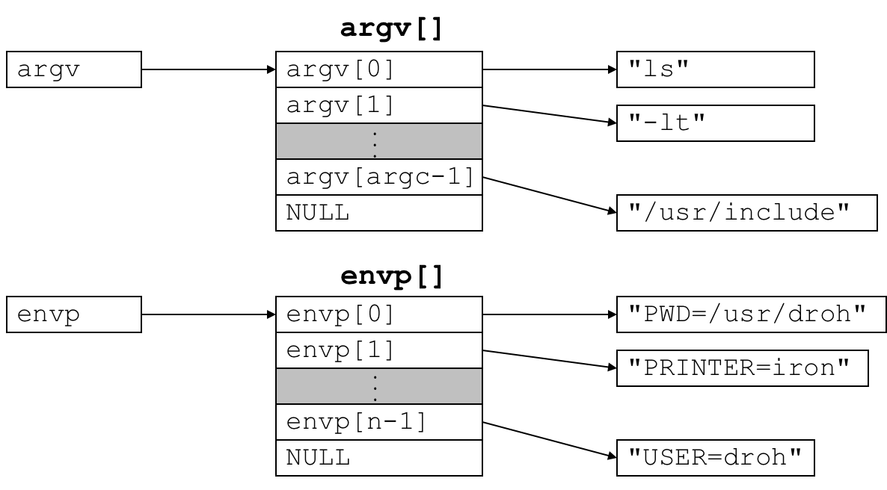

# 3.3 Wait

> for Godot

## Outline

* 回收子进程
* 进程睡眠
* 从磁盘加载并运行程序

## Textbook

* 8.4

## Reap Child

### Parent & Child

人类社会，一般是孩子给父母送终的。

但是，计算机世界中的思路是不一样的：既然孩子是你弄出来的，当然也应该由你父进程负责回收。

> 注意，一个由 OS 直接创建的进程，其父进程会被设定为 `init` 进程；其 PID 是固定的「1」。

### Terminus

在一个子进程退出（Terminate）的时候，OS 并不会马上把它所占有的资源回收，只会将其状态设定为特殊的「Zombie 态」。

相反，这项任务交给了创建他的父进程。当有个进程丧子时，`SIGCHLD` 信号就会被发送给创建他的父进程。

### APIs

```c
#include <sys/types.h>
#include <sys/wait.h>
pid_t waitpid(pid_t pid, int *status, int options);
pid_t wait(int *status);
```

#### `pid` Argument

给 `waitpid` 的 `pid` 参数传递某个大于 0 的正数，就会特定地等待她退出，并且回收其资源。

给 `waitpid` 的 `pid` 参数传递 -1，就会等待自己的任何一个子进程退出，并且回收其资源。

如果当前进程没有子进程，那么调用会失败（返回 -1），并且将 `errno` 设定为 `ECHILD`。

如果等待过程被某个信号中断，那么调用会失败，并且将 `errno` 设定为 `EINTR`。

#### `options` Argument

如果将 `options` 设定为 0，那么：

* 调用方程序会阻断，并且持续等待等待列表中的某个进程结束；

* 如果等待列表中已经有一个进程退出（且没有被回收，即位于 Zombie 态），那么直接将其回收并且返回其 `pid`；

* `waitpid` 函数总是返回「引起其返回的那个进程的 PID」；

* 返回 PID 对应的进程永远从系统中消失，其资源也被回收。

如果将 `options` 设定为 `WNOHANG`，那么：

* 在当前没有僵死子进程在等待列表中的情况下，就直接返回 0。

> 因为 PID 最少也是 1，所以不会和正常回收的情况产生矛盾。

如果将 `options` 设定为 `WUNTRACED`，那么：

* 调用方程序会阻断，直到某一个等待列表中的程序停止为止。

> 即，已经僵死的进程不能作为返回的触发者。

如果将 `options` 设定为 `WNOHANG | WUNTRACED`，那么：

* 如果当前没有僵死进程位于等待列表中，那么直接返回 0。
* 否则，返回一个位于等待列表中的僵死进程的 PID。

> 我深刻怀疑这套 API 设计者的心理状况。

#### `status` Argument

其实这是个 `out` Argument，即 `waitpid` 会向此处的内存地址写入一个 `int`，作为返回值的补充。

* 可以通过 `WIFEXITED(status)` 来判断这个子进程（如果有）是否正常退出（通过调用 `exit` 或者执行到最末，自然死亡的）。
* 可以通过 `WEXITSTATUS(status)` 来获得子进程的返回值。

* 可以通过 `WIFSIGNALED(status)` 来判断这个进程是否是因为收到了外部 Signal 而死。

* 可以通过 `WTERMSIG(status)` 来获取让这个进程结束的外部 Signal 号（只有在 `WIFSSIGNALED` 为真时才有意义）。
* 可以通过 `WIFSTOPPED(status)` 判断这个进程是否已经停止。
* 可以通过 `WSTOPSIG(status)` 来获取让这个进程停止的 Signal 号（只有在 `WIFSTOPPED` 为真时才有意义）。

> 这套 API 设计得真是一言难尽…

#### Obsoleted `wait`

是功能比较弱鸡的 `waitpid`。

等价于调用 `waitpid(-1, &status, 0)`。

不允许非阻塞式地等待。不允许特定地等待某个子进程。

## Load & Run

怎么创建一个新进程，而不是把自己复制一份呢？

### `execve`

```c
#include <unistd.h>
int execve(const char *filename, const char *argv[], const char *envp[]);
// does not return if OK, returns -1 on error
```

这个 `execve` 也比较反直觉：调用完了，新进程就直接把当前进程给覆盖掉，开始执行了…

因此 `execve` 一旦返回，就说明这个过程没有成功；因为成功的话根本不应该返回到调用方执行…

`argv` 和 `envp` 都是很简单的 `char *[]` 构造。



所以如果你想产生一个新进程，同时不影响自己的后续执行，应该：

* 先 fork 一份当前进程
* 父进程接着执行
* 子进程 `execve` 掉

虽然看起来「把父进程先 Copy 一份再 Execve 替换掉它」看起来很浪费…

但是因为有 Copy on Write 机制，实际上的 Copy 量不大。这样做也是可以接受的。

