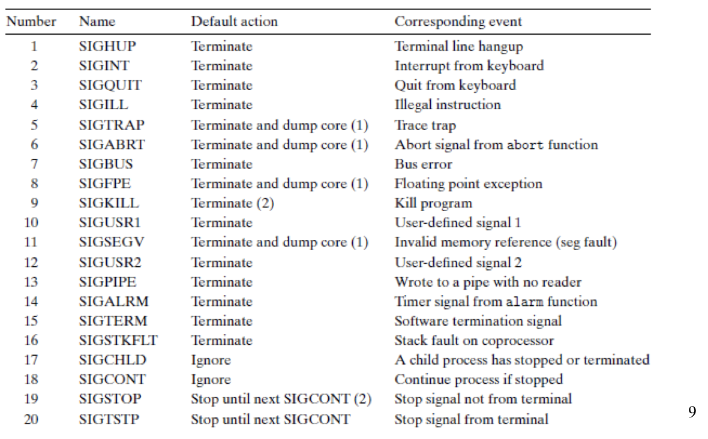
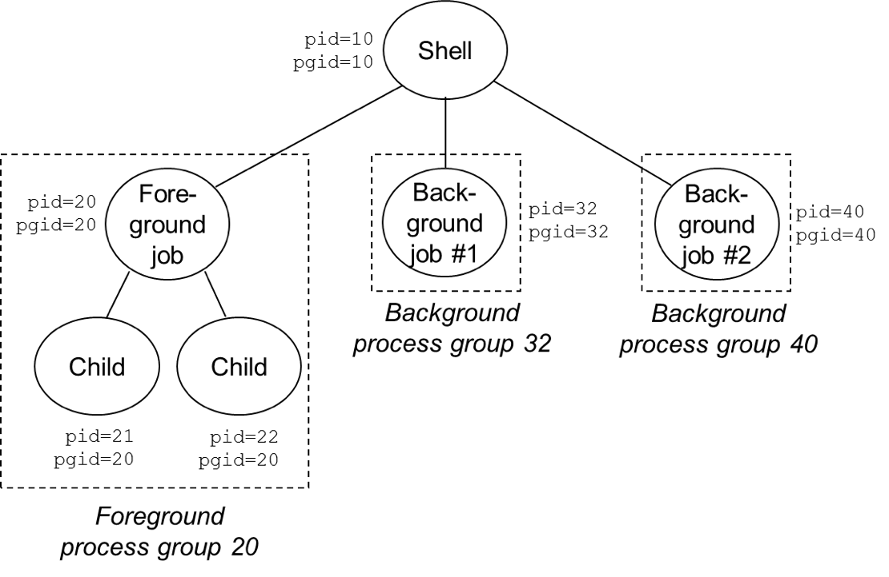
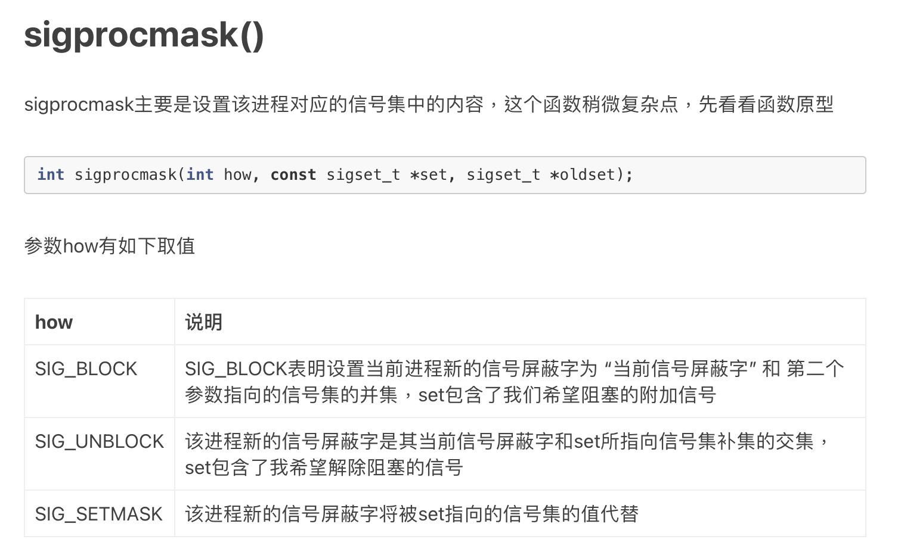

# 3.4 Signal

## Textbook

* 8.5

## Outline

* 信号术语
* 发送信号
* 接收信号
* 阻滞（及解除阻滞）信号

## Signals

### Intro

这里的信号不是跟 CPU 实现具体相关的「异常」、「中断」这些东西了，而是由 OS Kernel 所管理的、基于硬件中断，却又和具体硬件实现无关的「软件」信号。

我们来看 Unix 的状况。

### Unix Signal

#### `kill` me

最简单的，我们如何杀死一个进程？

回答：给他发送九号信号。

```shell
unix> kill -9 15213
```

就是给 `15213` 号进程发送 `9` 号信号（别名 `SIGKILL`）。

由于大家太经常地发送这一号信号，连带着把发送信号的这个程序的名字都改成了 `kill`。

> 实际上 `kill` 可以发送任何一种信号。功效也并不一定是 KILL。

#### Types

信号 ID 以一个正整数的形式表示。通过 OS Kernel 的调度管理，可以实现打断程序正常执行流的效果。

其中比较常用的几个信号类型有：

* `SIGKILL`，Number 9。发给谁谁死。
* `SIGFPE`，Number 8。如果某个进程尝试除以 0，就会收到这一严厉的警告。
* `SIGILL`，Number 4。如果某个进程执行的指令是非法的话。
* `SIGSEGV`，Number 11。段落错误。通常是因非法的内存访问而起。
* `SIGINT`，Number 2。按下 `Ctrl + C` 时触发的异常。
* `SIGCHLD`，Number 17。在某个子进程死亡时，其父进程会收到这么一则消息。

你可以通过 `man signal` 来查看完全的信号列表。



> 表中还列出了 Default action；即在程序不进行信号处理的情况下，会默认采取的动作。
>
> 标注有 (1) 和 (2) 的默认行为不可改变。

### Terminology

只需要解释清楚两个问题：怎么发？怎么收？

#### Sending Signals

信号信息是独立于进程存在的；因此可以合理地猜测，发出信号会在其目标进程的上下文中留下**点什么**。然後，在控制权将要转移到目标进程时，会通过检查这**点什么**来决定要采取的措施。

显然这事超过了发送进程的能力；Unix 提供了类似的 `kill` 函数来做成这件事。

```c
#include <sys/types.h>
#include <signal.h>

int kill(pid_t pid, int sig);
// returns: 0 if OK, -1 on error
```

> 这个 `kill` 函数跟 Shell 命令 `kill` 一脉相承…

具体的用法我们待会讲 API 时说。

#### Receiving Signals

站在接受进程的角度来说，对于每一个信号而言，他可以：

* 不做特殊处理，直接采取 OS 默认行为
	* （取决于具体的信号类型，可能什么都不会发生）
	* （也可能就直接 Core Dump 了）
* 捕获这个信号，执行自己的（用户态的）处理函数（Handler）
	* 当然要注意某些信号是无法捕获的

#### Pending

显然，上面提到的「Send/Recv」过程并不是同步的；即，发出一个信号之後，并不能保证立即就能传达到目标进程。那么这种游离态的信号就称作「Pending Signals」。

游离信号遵循下面的规则：

* 同一时刻、同一类型最多只能有一个游离信号。

> 即，不允许同时存在多个同类型的游离信号。
>
> > 你大概也猜出来了，这应该就是一个简单的标识位信号缓冲区的实现。

* 如果某一进程当前拥有一个类型为 $k$ 的等待信号，且此时又收到一个同类型的信号的话，这个信号会简单地被抛弃。

> 实现中，就是缓冲区的状态只有 0 和 1，再往上也记录不了更多了（

这就引出了一条箴言：

> A pending signal is received at most once.

#### Blocking

一个进程可以选择性地「阻碍」某些类型的信号。

其具体的实现是：

* 允许信号被投递
* 允许其在 Signal Cache 中 Pending
* 拒绝其触发对应的处理函数

因此，实际上并没有阻止信号传递到缓冲区中；只是选择性地不去拿去这些信号而已。

#### Unblocking

当然，可以取消阻断某些信号量；此时因为 Blocking 而阻滞在缓冲区中的信号（如果有）就会开始触发 Handler 了。

> 注意，Handler 的触发顺序完全不能反映实际到来的顺序。
>
> > 就好像用一个大筛子筛信号，留下来的阻滞信号再一把抓起来。并不能保证那是实际上被筛过的顺序。

## Unix Anecdotes

### Process Groups

所谓的「进程组」，是将同一个信号批量发送给多个进程的必要抽象基础。

基于下面的事实：

* 每个进程都必然属于且仅属于一个进程组。
* 默认状态下，每个进程都和其父亲进程属于同一个进程组。

进程可以自己和自己的子进程（调用 `exec__` 之前的）设置进程组，通过下面的方法：

```c
#include <unistd.h>
pid_t getpgrp(void);
// returns process group ID of calling process

#include <unistd.h>
pid_t setpgid(pid_t pid, pid_t pgid);
// returns 0 on success, -1 on error
```

首先，每个进程都可以用 `getpgrp()` 来获取自己当前所在的进程组 ID。

另外，还可以通过 `setpgid(WHICH_PROCESS, WHICH_GROUP)` 来给 `WHICH_PROCESS` 设置进程组。

如果 `pid` 设置成 0，那么默认就是给自己设置进程 ID。

> `setpgid(0, PGID)` 等价于 `setpgid(getpid(), PGID)`。

如果 `pgid` 设置成 0，那么默认就是把 `pgid` 设置成目标进程的 `pid`。

> `pgid` 等于 `pid` 的进程，就是这个进程组的「组长」。

> 这套 API 的设计者是有什么童年阴影吗？
>
> > 各种默认值，如果这样，如果那样。

所以，实际上 `setpgid(0, 0)` 等价于 `setpgid(getpid(), 0)` 等价于 `setpgid(getpid(), getpid())`。相当于自己翻身进程做组长了。

自己开一组新进程，进程号就是自己的 PID。

### `kill` us

大家都知道，

```shell
unix> kill -9 15213 # 告诉 15213 号进程去死
```


如果想要发送给 15213 号进程组里的每一个进程呢？

这么写：

```shell
unix> kill -9 -15213 # 告诉 15213 组中的所有人，都去死
```

真好！和前面的 API 设计一脉相承。反正就是让你看不懂就对了。

> 只要我写起来简单就好，愚者看不懂是自己的问题

还有更离谱的：怎么用 C API 来给一组进程发信号呢？

```c
#include <sys/types.h>
#include <signal.h>
int kill(pid_t pid, int sig);
// returns 0 if OK, -1 on error
```

还是这个函数；但是如果传入的 `pid` 为负数，就把他的绝对值当作进程组解读…

所以回头看，上面的 `kill -9 -15213` 的 `-15213` 的 `dash` 并不是 Argument Token，而是…负数…

> 我绝绝对对地叹服了。

### Shell

Shell 担负着赋予其他进程生命的光荣接生员职责。

但生出来的毕竟不是自己的孩子，因此一般医生出来就会将其赋予独立的 PGID，各自为家。



之後他们再有各自的孩子，就和 Shell 完全无关了。

### Keyboard Shortcuts

如果按下 `ctrl-c`，那么当前前台进程就会收到一条 `SIGINT` 信号。

> 其实呢，具体来说这个信号先传到了 Shell 那儿，然後 Shell 才根据当前活跃进程将其转发到位。

按下 `ctrl-z`，事情几乎一样，只不过变成了 `SIGTSTP` 信号。

### Wake me up

比较特别地一个信号就是 `SIGALRM`。他特别地被用在 `alarm` 函数上。

```c
#include <unistd.h>
unsigned int alarm(unsigned int secs);
// returns remaining secs of previous alarm, 
// or 0 if no previous alarm
```

首先，在干净的状态下调用 `alarm(sec)`，会返回 0。同时，定一个 `sec` 秒的倒计时；在倒计时结束之后，当前进程会收到一个 `SIGALRM` 信号。

但如果在调用时已经存在一个正在计时中的 `alarm`，那么那个旧 `alarm` 就会被取消掉，被那个新闹钟所取代。旧闹钟的残余时间会作为较新的那次 `alarm` 调用的返回值返回。

> 虽然我们叫它 Alarm 闹钟，但是实际上 `SIGALRM` 的默认行为是 Terminate 掉这个进程…
>
> > 杀人闹钟，一睡不起

### Signal Handlers

> 等待一个信号时，我们到底在等待什么

#### OS's Work

OS Kernel 的行为很简单——只是把目标进程对应的信号缓冲区中对应的信号位标记为 1。

而每当进程被调度到时，OS Kernel 会遍历检查所有被设置了的信号标识位。假如其中有 pending 的、并且没有被 blocked 的 Signal，那么就从符合要求的信号中挑选一个（按照国际惯例，一般是挑选信号 ID 比较小的那个）触发信号处理机制。

> 就是 `pending & ~blocked` 中不为 0 的位

#### Receiver's Work

如果 Receiver 不作为，那么 OS 会按照预先设定好的行为进行处理。

> 无非就是「什么都不做」或者「杀死这个进程」。

Receiver 当然也是有办法自定义信号处理的：

```c
#include <signal.h>
typedef void handler_t(int)
handler_t *signal(int signum, handler_t *handler);
// returns ptr to previous handler if OK
// SIG_ERR on error (does not set errno)
```

通过传递 `void foo(int)` 类型的函数指针，就可以注册自己的信号处理函数啦。

所以，真实的信号处理是这样的：


注意到 `handler_t` 的那个 `int` 参数了吗？那个参数（当然）就是 Signal ID 啦。

这样实现可以让同一个 `handler_t` 对象作为多个 Signal 的处理函数。

### Interrupt the Interruption

> 打断打断

程序正在执行着某个 Signal 的 Handler 的时候，并不会因此而得到任何特别的优待。仍然可能随时被调度、被**打断**。

即，可能你正在 Handle Signal A，此时 Signal B 来了，那么停下手上的工作，先 Handle Signal B，而此时 Signal C 又来了…


不过有必要说明的是：Signal A 无法打断他自己的 Signal A Handler。

原因是：Kernel 会在 Handle Signal A 时，隐含地帮你把 Signal A 给 block 住，防止重入。在 Signal A Handler 结束之后，再隐含地帮你 unblock 掉。

> 假如处理 Signal A 时真的有另一个 Signal A 来了，那么他就会在 Cache line 中 pending，直到 Signal A 结束後 block 状态解除，稍后再次进入 Signal A Handler。

### Blocking & Unblocking

```c
#include <signal.h>

int  sigprocmask(int how, const sigset_t *set, sigset_t *oldset)
int  sigemptyset(sigset_t *set) ;
int  sigfillset(sigset_t *set);
int  sigaddset(sigset_t *set, int signum);
int  sigdelset(sigset_t *set, int signum); // returns 0 if OK, -1 on error
int  sigismember(const sigset_t *set, int signum); // returns 1 if member, 0 if not, -1 on error
```

之前 `wait` 和 `pid` 系列函数无所不用其极地减少函数调用，复杂化单个函数，怎么到这里突然分这么散？

更奇怪的是，`sigemptyset`、`sigfillset`、`sigaddset`、`sigdelset` 分散开来就算了，怎么 `sigprocmask` 又回到大染缸状态了呢（超级难看的 `int how`）？

能把简单的一个「Block & Unblock」弄成这副鬼样子，我是很佩服的。



> 另外呢，`oldset` 是会被更新的，而 `set` 只是作为参量使用（因此被声明成 `const sigset_t *`）。
>
> 所以更新之後这个 `oldset` 就并不 `old` 了…你好歹叫它 `manipset` 之类的啊…

> 这套 Wait + Signal 相关的 API，实在太醜了…