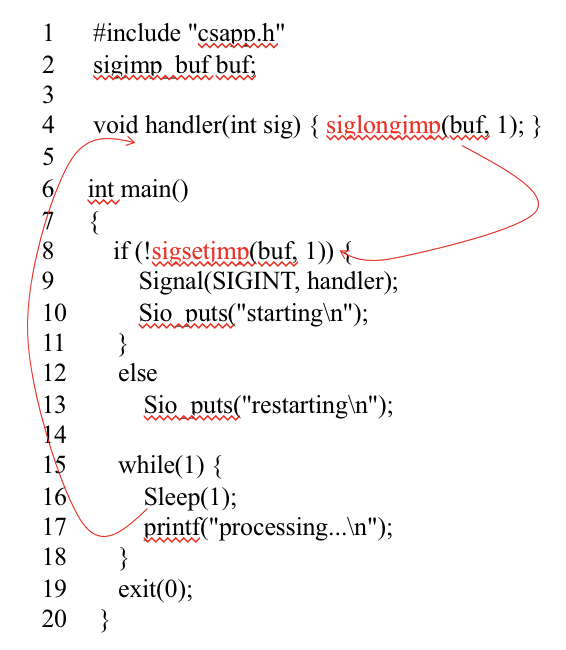

# 3.6 `ljmp`

## Textbook

* 8.6

## Outline

* Non-local Jump

> * Local Jump
> * ~~Rapid Jump~~
> * ~~Express Jump~~

## Non-local Jumps

> 何谓「非本地的跳转」？

把控制权直接从当前函数转移到另一个执行中的函数。

不经过调用 SOP、没有寄存器的保存恢复、没有返回地址的入栈。

### C APIs

首先 `#include <setjmp.h>`。

只有两个函数。简洁明了。

```c
int setjmp(jmp_buf env);
// returns 0 from setjmp, 
// nonzero from long jumps

void longjmp(jmp_buf env, int retval);
// never returns
```

`setjmp` 会把当前函数的栈上下文保存在 `env` 里，然後返回一个 0。

在调用 `longjmp(某个之前保存好的 env, 一个你想设成什么就是什么的 return value)` 的时候，程序就会突然回到 `setjmp` 那时的光景，同时设置好栈上下文，让你可以正确地回到调用 `setjmp` 那时继续。

* 唯一的区别就是：这次 `setjmp` 的返回值会成为 `retval` 指定的那个。

> 换句话说，就是在恢复上下文的时候，把 `%rax` 改成了某个特定值，用来和 Set 那时作区分。

> 重返二十岁，可以吗？
>
> > 实际上也就刚满二十一岁 10 天而已…

### Usage

这有什么用呢？简单说，可以在 C 中实现类似于「异常处理函数」的功能。

例如，可以先注册一个异常处理函数：

```c
void register_exception_handler() {
    static jmp_buf buf;
    int retval = setjmp(buf);
    switch (retval) {
        case 0:
            printf("exception handler registered!\n");
            break;
        default:
            printf("program reports an %d error!\n", retval);
            exit(-retval);
            break;
    }
}
```

然後，就可以这么利用：

```c
int main() {
    register_exception_handler();
    
    // ... do something
    
    if (BLA_BLA_BLAH) {
        longjmp(buf, 1);
        // report a #1 error
    } else if (WAI_BI_BA_BU) {
        longjmp(buf, 2);
        // report a #2 error
    }
}
```

这个设计很精巧：`setjmp` 被调用了一次。但是却返回了两次：第一次是正确设置，返回了 0；第二次是假装回到那时，但给了一个不一样的 `%rax` 返回值。

### Warning

不要在 C++ 中利用这一套。对于 C 来说，简单拷贝、恢复栈的上下文是没有危害的——栈里面不是内置类型就是 POD（Plain Old Data）。但是在 C++ 中毫无疑问会引起错误的多次析构的问题，并且弄乱引用计数。

实际上（据 Stroustrup 说）C++ 中的异常就是为了取代 `ljmp` 而设计的。异常语句写起来更自然、更容易理解，更重要的是总能保证临时对象的正确析构…而这套拷贝还原的花招不能。

## Signal-based Jump

```c
int sigsetjmp(sigjmp_buf env, int savemask);
// returns 0 from sigsetjmp,
// nonzero from siglongjumps

void siglongjmp(sigjmp_buf env, int retval);
// never returns
```

同样是在 `<setjmp.h>` 里定义的。

和 Signal 系统配合使用，才能实现「异常处理函数结束後，Alter 主线程的执行流」的操作（因为 Handler 本身不是主函数调用的，所以没法直接在栈上看到她的地址）。



差不多就这样了吧。