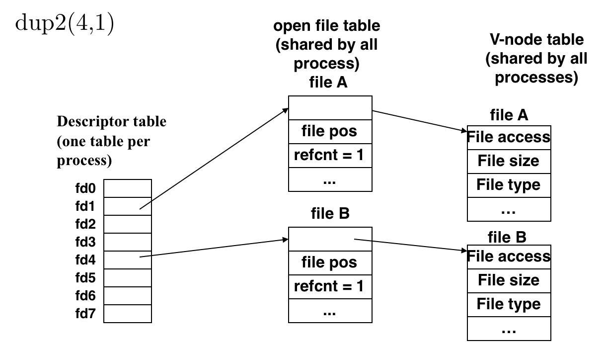
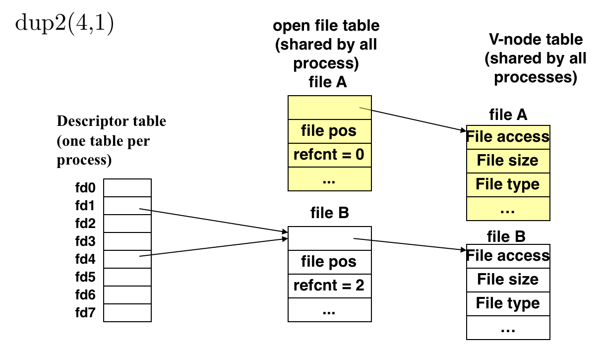

# 3.7 I/O

## Outline

* Unix 的 I/O
* 记录文件元数据
* 目录
* 共享文件
* I/O 重定向

## Textbook

* 10.1
* 10.2
* 10.3
* 10.4
* 10.6
* 10.7
* 10.8
* 10.9

## I, and O

### Who's in, who's out?

Input/Output，「一种在内存和外部设备之间拷贝数据的过程」。

通常我们以 CPU 为心，把从「外部设备」到「内存」的过程叫做 Input（例如，从键盘读取输入）；把「内存」到「外部设备」的过程叫做 Output（例如，把数据输出到显示器上）。

### System Call

任何一个合理可用的操作系统都应该提供「读取输入」和「打印输出」的功能。在 Unix 而言，这些事宜通过「系统调用」实现。

例如，对这个超简单的小程序来说：

```c++
#include <iostream>

using namespace std;

int main()
{
	cout << "Hello, world!" << endl;
}
```

用 `strace` 跟踪一下她所进行的系统调用：

```shell
yue@ubuntu:~/Desktop$ strace ./foolish 
execve("./foolish", ["./foolish"], 0x7ffe53fbe930 /* 52 vars */) = 0
brk(NULL)                               = 0x5588fbd6f000
access("/etc/ld.so.preload", R_OK)      = -1 ENOENT (No such file or directory)
openat(AT_FDCWD, "/etc/ld.so.cache", O_RDONLY|O_CLOEXEC) = 3
fstat(3, {st_mode=S_IFREG|0644, st_size=69905, ...}) = 0
mmap(NULL, 69905, PROT_READ, MAP_PRIVATE, 3, 0) = 0x7f27d37de000
close(3)                                = 0
openat(AT_FDCWD, "/lib/x86_64-linux-gnu/libstdc++.so.6", O_RDONLY|O_CLOEXEC) = 3
read(3, "\177ELF\2\1\1\3\0\0\0\0\0\0\0\0\3\0>\0\1\0\0\0p\217\t\0\0\0\0\0"..., 832) = 832
fstat(3, {st_mode=S_IFREG|0644, st_size=1956680, ...}) = 0
mmap(NULL, 8192, PROT_READ|PROT_WRITE, MAP_PRIVATE|MAP_ANONYMOUS, -1, 0) = 0x7f27d37dc000
mmap(NULL, 1971648, PROT_READ, MAP_PRIVATE|MAP_DENYWRITE, 3, 0) = 0x7f27d35fa000
mprotect(0x7f27d368f000, 1294336, PROT_NONE) = 0
mmap(0x7f27d368f000, 991232, PROT_READ|PROT_EXEC, MAP_PRIVATE|MAP_FIXED|MAP_DENYWRITE, 3, 0x95000) = 0x7f27d368f000
mmap(0x7f27d3781000, 299008, PROT_READ, MAP_PRIVATE|MAP_FIXED|MAP_DENYWRITE, 3, 0x187000) = 0x7f27d3781000
mmap(0x7f27d37cb000, 57344, PROT_READ|PROT_WRITE, MAP_PRIVATE|MAP_FIXED|MAP_DENYWRITE, 3, 0x1d0000) = 0x7f27d37cb000
mmap(0x7f27d37d9000, 9664, PROT_READ|PROT_WRITE, MAP_PRIVATE|MAP_FIXED|MAP_ANONYMOUS, -1, 0) = 0x7f27d37d9000
close(3)                                = 0
openat(AT_FDCWD, "/lib/x86_64-linux-gnu/libc.so.6", O_RDONLY|O_CLOEXEC) = 3
read(3, "\177ELF\2\1\1\3\0\0\0\0\0\0\0\0\3\0>\0\1\0\0\0\200l\2\0\0\0\0\0"..., 832) = 832
fstat(3, {st_mode=S_IFREG|0755, st_size=2000480, ...}) = 0
mmap(NULL, 2008696, PROT_READ, MAP_PRIVATE|MAP_DENYWRITE, 3, 0) = 0x7f27d340f000
mmap(0x7f27d3434000, 1519616, PROT_READ|PROT_EXEC, MAP_PRIVATE|MAP_FIXED|MAP_DENYWRITE, 3, 0x25000) = 0x7f27d3434000
mmap(0x7f27d35a7000, 299008, PROT_READ, MAP_PRIVATE|MAP_FIXED|MAP_DENYWRITE, 3, 0x198000) = 0x7f27d35a7000
mmap(0x7f27d35f0000, 24576, PROT_READ|PROT_WRITE, MAP_PRIVATE|MAP_FIXED|MAP_DENYWRITE, 3, 0x1e0000) = 0x7f27d35f0000
mmap(0x7f27d35f6000, 13944, PROT_READ|PROT_WRITE, MAP_PRIVATE|MAP_FIXED|MAP_ANONYMOUS, -1, 0) = 0x7f27d35f6000
close(3)                                = 0
openat(AT_FDCWD, "/lib/x86_64-linux-gnu/libm.so.6", O_RDONLY|O_CLOEXEC) = 3
read(3, "\177ELF\2\1\1\3\0\0\0\0\0\0\0\0\3\0>\0\1\0\0\0\0\362\0\0\0\0\0\0"..., 832) = 832
fstat(3, {st_mode=S_IFREG|0644, st_size=1365096, ...}) = 0
mmap(NULL, 1364240, PROT_READ, MAP_PRIVATE|MAP_DENYWRITE, 3, 0) = 0x7f27d32c1000
mmap(0x7f27d32d0000, 679936, PROT_READ|PROT_EXEC, MAP_PRIVATE|MAP_FIXED|MAP_DENYWRITE, 3, 0xf000) = 0x7f27d32d0000
mmap(0x7f27d3376000, 618496, PROT_READ, MAP_PRIVATE|MAP_FIXED|MAP_DENYWRITE, 3, 0xb5000) = 0x7f27d3376000
mmap(0x7f27d340d000, 8192, PROT_READ|PROT_WRITE, MAP_PRIVATE|MAP_FIXED|MAP_DENYWRITE, 3, 0x14b000) = 0x7f27d340d000
close(3)                                = 0
openat(AT_FDCWD, "/lib/x86_64-linux-gnu/libgcc_s.so.1", O_RDONLY|O_CLOEXEC) = 3
read(3, "\177ELF\2\1\1\0\0\0\0\0\0\0\0\0\3\0>\0\1\0\0\0\0203\0\0\0\0\0\0"..., 832) = 832
fstat(3, {st_mode=S_IFREG|0644, st_size=100736, ...}) = 0
mmap(NULL, 103504, PROT_READ, MAP_PRIVATE|MAP_DENYWRITE, 3, 0) = 0x7f27d32a7000
mmap(0x7f27d32aa000, 69632, PROT_READ|PROT_EXEC, MAP_PRIVATE|MAP_FIXED|MAP_DENYWRITE, 3, 0x3000) = 0x7f27d32aa000
mmap(0x7f27d32bb000, 16384, PROT_READ, MAP_PRIVATE|MAP_FIXED|MAP_DENYWRITE, 3, 0x14000) = 0x7f27d32bb000
mmap(0x7f27d32bf000, 8192, PROT_READ|PROT_WRITE, MAP_PRIVATE|MAP_FIXED|MAP_DENYWRITE, 3, 0x17000) = 0x7f27d32bf000
close(3)                                = 0
mmap(NULL, 8192, PROT_READ|PROT_WRITE, MAP_PRIVATE|MAP_ANONYMOUS, -1, 0) = 0x7f27d32a5000
arch_prctl(ARCH_SET_FS, 0x7f27d32a5f40) = 0
mprotect(0x7f27d35f0000, 12288, PROT_READ) = 0
mprotect(0x7f27d32bf000, 4096, PROT_READ) = 0
mprotect(0x7f27d340d000, 4096, PROT_READ) = 0
mmap(NULL, 8192, PROT_READ|PROT_WRITE, MAP_PRIVATE|MAP_ANONYMOUS, -1, 0) = 0x7f27d32a3000
mprotect(0x7f27d37cb000, 45056, PROT_READ) = 0
mprotect(0x5588fb0d0000, 4096, PROT_READ) = 0
mprotect(0x7f27d381a000, 4096, PROT_READ) = 0
munmap(0x7f27d37de000, 69905)           = 0
brk(NULL)                               = 0x5588fbd6f000
brk(0x5588fbd90000)                     = 0x5588fbd90000
fstat(1, {st_mode=S_IFCHR|0620, st_rdev=makedev(136, 0), ...}) = 0
write(1, "Hello, world!\n", 14Hello, world!
)         = 14
exit_group(0)                           = ?
+++ exited with 0 +++
```

上面的全都不用看，唯有最後一行 `write(1, "Hello, world!\n", 14)` 真的在干活。

> 注意，`strace` 在分析系统调用时，真的会把这个程序跑一次。
>
> 所以，你看到混乱的 `write(1, "Hello, world!\n", 14Hello, world!
> )         = 14`，其实是 `write(1, "Hello, world!\n", 14)				 = 14` 和 `Hello, world!\n` 混一块了…

`write` 不仅仅可以打印到屏幕（设置第一个参数为 `1`，也就是 `sysout`），还可以通过提供不同的 `fd` 来写到其他文件里。`read` 同理。可以从键盘读，也可以从任何文件读。

## File System

### Intro

文件系统…您去看看 CSE 好啦。

总归记住一点，不要把「文件夹」叫做文件夹，因为它并不是包含着所有的、其内部所有文件的「文件夹」。

只是书的目录而已。目录只是引用了其中的文件。

> 当然，和真实世界的书不同，或许循着目录找到的东西是另一个目录…这个另说。

Unix 把很多东西都抽象成了文件，包括：

* 磁盘文件
* 外部 I/O 设备
* 网络 Socket 字

当然，并不是所有的「文件」都具有相同的 Capability。

例如，你可以用 `seek` 和 `rseek` 来随意更新某个文件的读取头；但无法对 I/O 设备和套接字进行这样的操作。

你可以对普通文件和 Socket 进行读、写操作，但无法从 `stdout` 流中读取，也无法向 `stdin` 中写入。

但这一切都被包裹在 `fd`（File Descriptor）这层抽象之下。

### `fd`

身为「描述符」，这个数字本身并没有任何语义。在用户态代码中你也无法对其进行操作。

在 Kernel 的心中，`fd` 实际上是一张「File Descriptor Table」大表的索引。像这样：


这时候，`fd` 的取值才体现出了意义。

### Process Specific

注意，尽管没有必要（因为持有 `fd` 想做任何事情都要过 OS，所以不存在隔离性的问题），但是 OS Kernel 还是为每个进程都提供了一张 Descriptor Table。

毕竟，一个进程所开的 `fd` 一般不多，每个条目的指针值也不多，开销也不大。

> 注意，虽然每个进程的「文件描述符表」是独立的，但其中可以包含指向相同数据结构的条目。

### `open` it

当你通过 System Call，打开一个文件时，发生了什么？

#### APIs

```c
#include <sys/types.h>
#include <sys/stat.h>
#include <fcntl.h>

int open(char *filename, int flags, mode_t mode);
// returns new file descriptor if OK, -1 on error

/* flags
    O_RDONLY, O_WRONLY, O_RDWR (must have one)
    O_CREAT, O_TRUNC, O_APPEND (optional)
*/

/* mode 
    S_IRUSR, S_IWUSR, S_IXUSR
    S_IRGRP, S_IWGRP, S_IXGRP
    S_IROTH, S_IWOTH, S_IXOTH
*/
```

#### Flags and Modes

首先，必须要从 `O_RDONLY`、`O_WRONLY`、`O_RDWR` 中选一种——要么读，要么写，要么读加写。

然後，可以选择是否 `O_CREAT`（文件不存在的话，创建一个）？`O_TRUNC`（如果文件存在的话，就截断为 0，从头开始写）？`O_APPEND`（如果文件存在，就在其尾部往后叠加）？

#### System

这时系统会在 FD Table 上记下一笔，以便说明「你正在引用这个文件！」。并且，记录下来你在读取的这个文件指针位置、权限、模式等等。

因为这个用起来实在太难看了（开个文件而已啊！），所以 `libc` 提供了更好用的、基于 `const char *` 的 `fopen`。

### `close` it

有来有回的事情。拿到了资源就得释放。

```c
#include <unistd.h>
int close(int fd) ;

// returns zero if OK, -1 on error
```

`close(fd)`，意味着「我不再想要这个文件了！」，告诉 OS 把这个 `fd` 从表中移除。

### `fd` Allocate Rules

OS 会始终按照这样的规则来分配 `fd`，即始终提供所可能提供的最小的那一个。

> 模仿胡言乱语楞次定律

实际上就是，每次分配都分目前空闲的最小的那个数。

### `read` & `write`

在你还持有某个 `fd` 的情况下，可以从/往这个 `fd` 描述的文件中读取/写入文件。

```c
#include <unistd.h>

ssize_t read(int fd, void *buf, size_t count);
// returns number of bytes read if OK,
// 0 on EOF, -1 on error

ssize_t write(int fd, const void *buf, size_t count);
// returns number of bytes written if OK, -1 on error
```

注意这里并不需要指明「从/往哪里读/写」。因为每个进程所持有的文件，都会隐含地得到一个「文件指针」。

初始状态下默认指向文件头部。

读取/写入 `n` 字节会相应地让指针向後移动 `n` 字节。

也可以通过 `seek` 来手动改变指针位置。

### Meta Data

怎么读元数据啊？

```c
#include <unistd.h>
#include <sys/stat.h>

int stat(const char *filename, struct stat *buf);
int fstat(int fd, struct stat *buf);

// returns 0 if OK, -1 on error
```

提供了这样的 API。`stat` 和 `fstat` 之间的区别仅在「是否预先打开了文件」。

输出方式都很 C；通过传递 `struct stat *` 指针作为输出的位置。

## File Sharing

在 Unix 系统中，同一个文件在多大程度上是共享的？

### One Source

首先，不论有多少个进程打开同一个文件，他们都指向同一个 `vnode` 条目。

> 否则问题就大了……直接破坏了文件系统抽象。


### Once Open

每调用一次 `open`，就会构造一个 Open File Table 条目。注意这个 OFT 是有引用计数的。


在 `fork` 时，父亲进程的 `fd` 会被简单拷贝到子进程中：


因为没有二次调用 `open`，所以还是指向同一个 OFT 条目。但是 `refcnt` 会增加，以便在所有进程退出时正确清理释放。

## I/O Redirection

何谓重定向？

```c
#include <unistd.h>

int dup2(int oldfd, int newfd);
// returns nonnegative descriptor if OK, -1 on error
```

通过 `dup2`，可以将对当前进程的任何涉及到 `oldfd` 的读写，全部跑偏到 `newfd` 上去。

> 这里的 `dup2` 应该理解作 Duplicate To。





在进行 `dup2` 时，实际上是更改了当前进程 FDT 表中的指向，同时更新 `refcnt`。

### Usage

例如，如果我们想要把所有的，向标准输出（`stdout`）打印的字节都放到一个文件里（这对调试很有作用的）的话，我们可以这么写：

```c
#include <unistd.h>
#define DEBUG

#ifdef DEBUG
dup2(1, fopen("./log", "w"));
#endif
```

这样，所有打印到标准输出的字节都会被放到 `./log` 中。

或者，在做单元测试的时候，我们当然是不希望手动输入输入参数的。那么，把一个文件当作 `stdin` 的输入也很自然了：

```c
#include <unistd.h>
#define DEBUG

#ifdef DEBUG
dup2(0, fopen("./pseudo_input", "r"));
#endif
```

