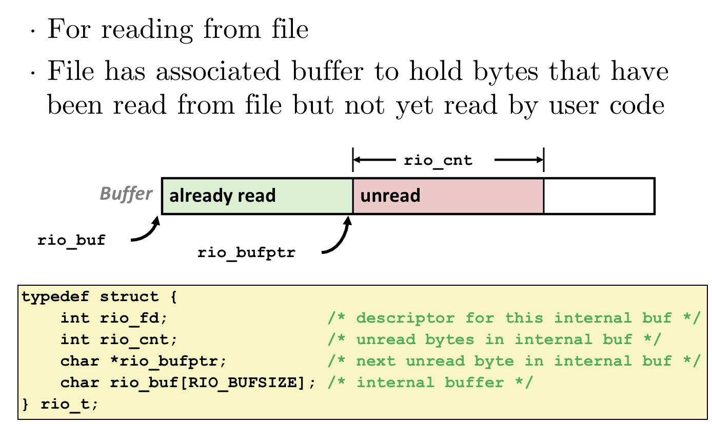

# 3.8 Robust I/O

## Textbook

* 10.5
* 10.10
* 10.11

## Outline

* Robust I/O
* Standard I/O

## RIO Package

### Intro

Robust…那么原来的版本不 Robust 在哪里？

### Buffer

考虑到这个问题：程序经常读/写非常短的字符串，甚至单个字符。

> 例如，标准库中的 `getc`、`putc`（还有 `ungetc`）等等。

但是要知道，每一次调用如果都走 System Call，那代价太高了——就为了那么一个字符，值吗？

> 经验值：每一次 Kernel Call 会消耗 10000 次时钟周期。

所以实际的实现中，标准库并不会「每遇到一次 `read`/`write` 就去请求一次 Kernel」，而是会在自己的内部保留一串定长的缓冲区。


一读就读一整个 Chunk，然後根据你所要求的 Read Size 一点点交给你（因为这样就变成用户态代码了，所以细分也不会怎么影响性能）。



`write` 也同样；即零碎的 `write` 会被先扔到缓冲区里，直到达到一定程度或是使用了 `ostream::flush()`，才会被打包扔给 Kernel。

> 代价就是，或许您的 `write` 可能不太及时…
>
> 而且，如果在输出流还没刷新之前程序炸掉了，那么或许这部分数据永远也不会被发给 OS 了（数据丢失）…

## Read

### APIs

所以，Robust I/O 实际上就是「在用户态 Cache 了的 I/O 接口」。

> 因为 Cache 的目的就是为了避免优先级切换、系统调用…所以在系统态 Cache 失去了意义。

```c
#include "csapp.h"

void rio_readinitb(rio_t *rp, int fd);
ssize_t rio_readlineb(rio_t *rp, void *usrbuf, size_t maxlen);
ssize_t rio_readnb(rio_t *rp, void *usrbuf, size_t maxlen);
// returns number of bytes read (0 if EOF), -1 on error
```

这个写的不是很漂亮…如果说用 C++ 的话是这样的：

```c++
class RIO {
public:
    RIO(int fd);
    size_t readlineb(void *dst, size_t maxlen);
    size_t readnb(void *dst, size_t maxlen);
    ~RIO();
private:
    void *buffer;
}
```

`readlineb` 在读取到 `maxlen` 个字节或是遇到了 `\n`、`EOF` 时会停止。

`readnb` 在读到 `maxlen` 个字节、或是读到 `EOF` 时会停止。

他们的返回值都是实际读到的字节数。

### Implementation

实现比想象中要复杂一些。

首先，在用户申请要读（至多） `maxlen` 个字节时，我们要考虑到的情况：

* 缓冲区里目前有没有那么多个字节？

如果没有，那么就必须先把缓冲区中已有未取的暂存字节拷贝到用户提供的 `dst` 中，再进行二次 I/O 读取。

换句话说，`rio_read` 系列函数可能阻塞的。请务必记住。

首先，我们实现一个辅助函数 `rio_read`；

```c
static ssize_t rio_read(rio_t *rp, char *usrbuf, size_t n)
{
    int cnt = 0;

    while (rp->rio_cnt <= 0)
    { /* refill if buf is empty */
        rp->rio_cnt = read(rp->rio_fd, rp->rio_buf,
                           sizeof(rp->rio_buf));
        if (rp->rio_cnt < 0)
        {
            if (errno != EINTR)
                return –1;
        }
        else if (rp->rio_cnt == 0) /* EOF */
            return 0;
        else
            rp->rio_bufptr = rp->rio_buf; /* reset buffer ptr */
    }
    /* Copy min(n, rp->rio_cnt) bytes from internal buf to user buf */
    cnt = n;
    if (rp->rio_cnt < n)
        cnt = rp->rio_cnt;
    memcpy(usrbuf, rp->rio_bufptr, cnt);
    rp->rio_buffer += cnt;
    rp->rio_cnt -= cnt;
    return cnt;
}
```

这个函数不考虑打断的 `EINTR`、不考虑 `\n`。只要没遇到 `EOF` 它就敢往缓冲区里读。

并且，每次最多只会读进 `sizeof(rp->rio_buf)` 个字节（再多了缓冲区搁不下）。

那么，基于 `rio_read` 实现 `rio_readnb` 就很简单了：

```c
ssize_t rio_readnb(rio_t *rp, void *usrbuf, size_t n)
{
    size_t nleft = n;
    ssize_t nread;
    char *bufp = usrbuf;
    while (nleft > 0)
    {
        if ((nread = rio_read(rp, bufp, nleft)) < 0)
        {
            if (errno = EINTR)
                /* interrupted by sig handler return */
                nread = 0;
            else
                return –1;
        }
        else if (nread == 0)
            break;
        nleft -= nread;
        bufp += nread;
    }
    return (n – nleft);
}
```

每次都尽可能地多读取（但实际上由于受制于 `rio_read` 缓冲区大小，往往需要多次才能读完）。

如果说没有足够多的字节呢？那么遇到 `EINTR` 或者 `EOF` 就自己退出。

`rio_readlineb` 就没这么豪放了：需要一个一个字节地读，逐个检查是否是` \n`。

```c
ssize_t rio_readlineb(rio_t *rp, void *usrbuf, size_t maxlen)
{
    int n, rc;
    char c, *bufp = usrbuf;
    for (n = 1; n < maxlen; n++)
    {
        if ((rc = rio_read(rp, &c, 1)) == 1)
        {
            *bufp++ = c;
            if (c == '\n')
                break;
        }
        else if (rc == 0)
        {
            if (n == 1)
                return 0; /* EOF, no data read */
            else
                break;
        }
        else
            return –1; /* error */
    }
    *bufp = 0;
    return n;
}
```

> 虽然代价还是很高（1 个 1 个读），但是考虑到是用户态代码的调用，代价比 SysCall 可以说是小多啦。

## `libc`

### Functions

C 的标准库里面已经提供了一套 I/O 函数，主要有：

* `fopen` & `fclose`
* `fread` & `fwrite`
* `fgets` & `fputs`
* `fscanf` & `fprintf`

他们的操作都依赖于文件描述符 `fd`，并且也提供了类似于 `RIO` 的缓冲区实现。

另外，有三个特殊的 `fd` 被映射到了变量名字上，包括：

```c
#define stdin  0
#define stdout 1
#define stderr 2
```

其中 `stdin` 是 `istream`，`stdout` 和 `stderr` 是 `ostream`。

### Buffering

在你打印的时候，发生了什么？

`write(stdout, "hello\n", 6)`。

I/O 函数在遇到打印 `\n`，或是 `fflush()` 的时候，会自动进行一次缓冲区的刷新。

## `sync_with_stdio`

众所周知，C++ 中的正牌输入输出是 `cin` 和 `cout` 这两位流对象。而 `cstdio` 里的 `printf`、`scanf` 仍保留可用。

但是，用大脑想一下都知道，他们的实现完全在不同的地方，显然也各自有不同的缓冲区。

假如容许这种情况的出现，那么双方各自保留缓冲区，输入输出的顺序就保证不了了！

即，可能出现这样的情况：

```c++
// 拒绝标准库的善意
std::ios::sync_with_stdio(false);

int i, j;

// input 2, 3
scanf("%d", &i);
std::cin >> j;

// i = 3, while j = 2!!!
```

这是因为 `scanf` 和 `cin` 读取缓冲区的时机和他们实际被从缓冲区中读出的时机不一定是同步的。

在只有一个缓冲区的情况下，这当然可以保证。但在两套机制的共同作用下，这可就不那么一定了！

```c++
// 拒绝标准库的善意
std::ios::sync_with_stdio(false);

printf("%d", 2);
std::cout << 3;
```

同理，不能确定 `cstdio` 和 `iostream` 谁先刷新其内部的缓冲区，所以谁先被打印出来完全看命。

但是，如果遇到这种情况是不会出现问题的：

```c++
// 拒绝标准库的善意
std::ios::sync_with_stdio(false);

printf("%d\n", 2);
std::cout << 3 << std::endl;
```

`printf` 在打到 `\n` 时就会自动刷新内部缓冲区。

至于下面那一行？这么写等价于

```c++
std::cout << 3;
std::cout << std::endl;
```

等价于

```c++
std::cout << 3;
std::cout << '\n';
std::cout.flush();
```

所以只要每次用输出设施前/後都进行一次流的刷新，那么这种不同步就伤害不到你。

当然，C++ 标准委员会的人们还是觉得这种情况太诡异了。所以他们在默认状态下打开了

```c++
std::ios::sync_with_stdio(true);
```

开关，通过（成倍的）性能损耗来维持 `cstdio` 和 `iostream` 之间的同步性。

> 实际实现中是 `iostream` 步步退让…

看你自己需不需要咯。要是从头到尾只使用一种 I/O 设施，那完全可以关掉。

## Choosing among I/O Infrastructures

* When to use standard I/O

When working with disk or terminal files

* When to use raw Unix I/O 

Inside signal handlers, because Unix I/O is async-signal-safe.

In rare cases when you need absolute highest performance.

* When to use RIO

When you are reading and writing network sockets.

Avoid using standard I/O on sockets.

所以这一节实际上也解释了，为什么 `cstdio` 设施不是线程安全的（有内部缓冲区，怎么会安全呢！）。

