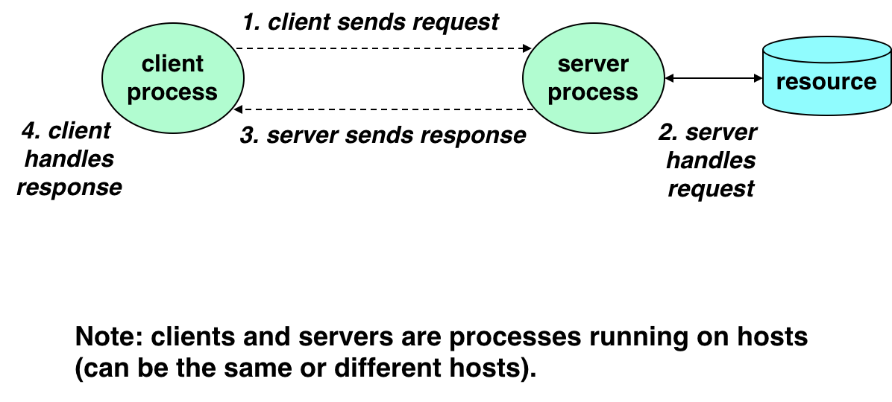
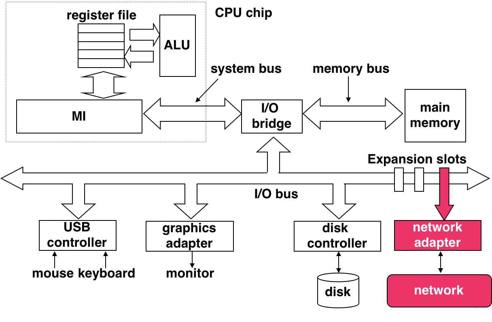
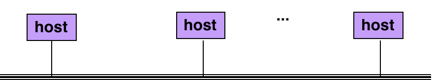
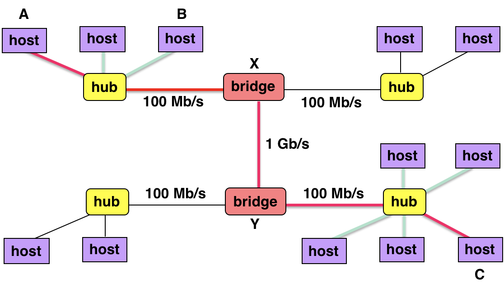
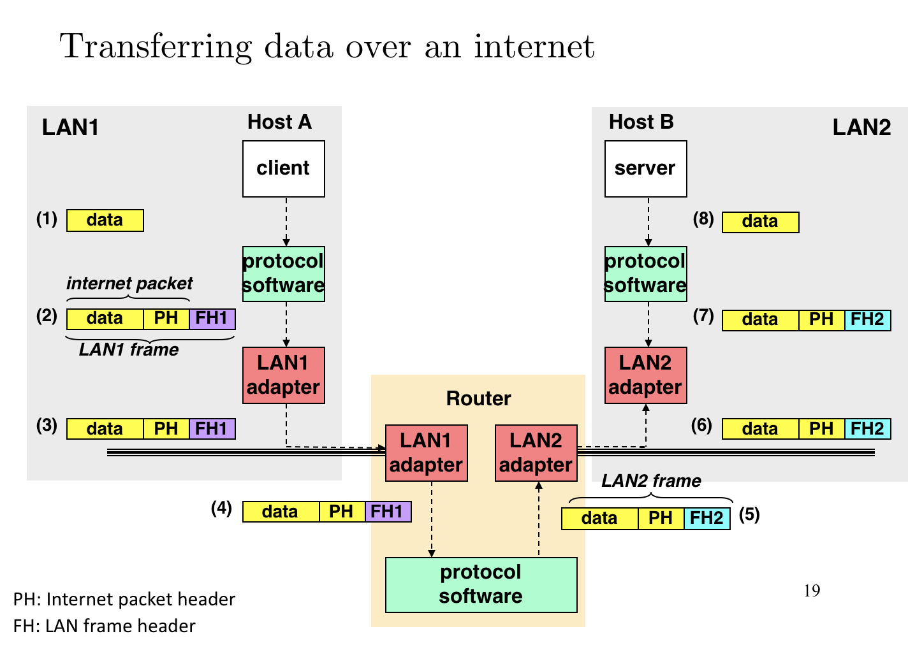
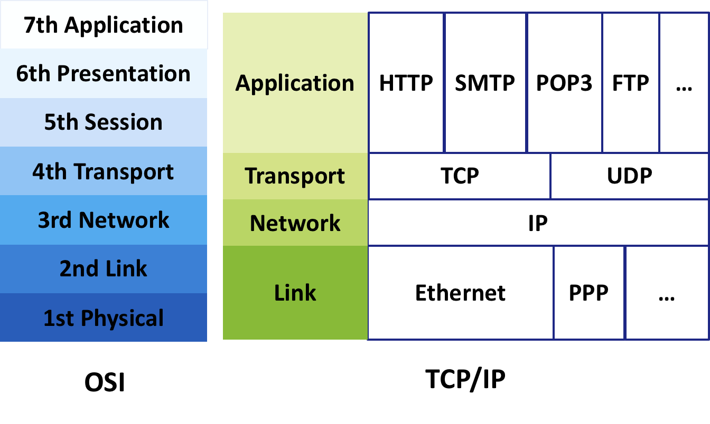
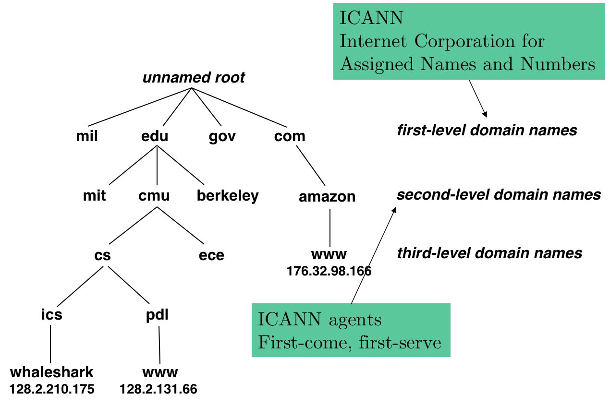

# 9.9 Network

## Textbook

* 11.1
* 11.2
* 11.3

## Outline

* C / S（Client & Server）开发模式
* 网络
* 全球 IP 网络

## C - S

### Intro

在 C - S 模型当中，双方的关系是这么定义的：

* 存在单个 Server 进程
* 存在一个或多个 Client 进程
* Server 管理、保存着某些资源
* Client 可以向 Server 提出请求
* Server 就此操作资源，作出回应



> 注意，C - S 的地位跟「运行在哪里的计算机之上」是无关的。
>
> 或许 Client 跟 Server 之间的通信是走过了网络、走过了 USB、走过了卫星链路。又或者他们执行在同一颗 CPU 上。

### Device

在 CPU 的眼里，Network 事宜也抽象成对 I/O 设备的操作。



> 读写比内存慢的统统视为外设——CPU

## Network

网络，和计算机一样是由森严的等级机制构建起来的。

### v1: Origin

最早的「网络」，那是物理存在的。把一群电脑用网线连起来，他们之间就能相互通信——这算是网络。



这就和计算机的总线很类似：所有人都能看到所有的数据包；大家凭自觉（道义）来确保数据包的正确传输。

#### Adapter Address

每个网络适配器有一个独一无二的 ID：48 Bit 的地址。

把他们分成六组，每组一个字节（8-Bit Guy）写成这样

```
00:16:ea:e3:54:e6
```

突然就有感觉了。

#### Host

每台连接到互联网上的计算机，都叫做一个 Host。

#### Frame

每一次，由一个 Host 发向另一个 Host 的 Bits，构成一个 Frame（帧）。

> 之所以构成一个 Frame，是因为他有语义。

每个 Frame 都包含：

* 魔法头，用于识别 Frame 格式、版本、来路、去向
* Frame 本体长度

这两部分之後就是裸字节 Payload 了。

### v2: Bridged

随着网络规模越来越大，把计算机两两链接也不太现实。

所以，自然而然地形成了「网络中枢」，各个边缘 Host 连接到次中枢（Hub），这就使得整个系统可扩展了。



中枢节点之间的传输速度自然要很快；到次中心减速；到 Host 那就另说了。

> 注意，Host 之间的链接并不一定会走中枢。
>
> 例如，Host A 和 Host B 之间的通信只要走 Hub 一遭就够了；不必要上升到 Bridge X。

#### WAN

> 所谓 Wide-Area Network

本地的小破网用 LAN 也就够了。但是如果各大中枢之间也用 LAN，岂不卡爆？所以就提出了 WAN 连接方法。

我们把网络中「超脱于 Host」上层的那些机器统称为 Routers——因为他们自身不作为任何数据包的起始和终结，只是负责把他们传送到正确的位置。

Routers 之间就采用了 WAN 方式组织——大批量、高效率。

> 不能再像 LAN 那样一个一个栈帧慢慢发了。那太慢了。

#### Protocol Software

既然 LAN 和 WAN 本质上是两套不同的协议，那么一个数据包是如何穿越他们传输的？

回答：Routers 上包含有特制的 Protocol Software，会在数据包在层级转换时自动进行变换。

## Internet Protocol

### Intro

所说的「Protocol」，协定，也就是一组规则而已。

整个全球网络都是由 TCP/IP 协议组织起来的。

### Terminologies

#### Naming Scheme

要想所有的计算机都能相互连接，总得有一个「标识」来标记他们。

如何记录？这套组织方式是 IP 需要处理的事情。

#### Delivery Mechanism

如果 A 想给 B 发送一段数据（例如，`n` 字节），那么不可能在网络中只发布这 `n` 个字节。

先不考虑完整性、完整性，总得有点元数据来告诉「从哪儿来？到哪儿去？」。

实际在发送数据包之前，会先发送一个标准格式的包头；其中最重要的（一定要有的）就是「Payload 长度」。否则就不知道该往後读多少字节了。

> 具体的格式都是协议的内容。

### Data Transferring




从头到尾地整理吧。

* 首先，Host A（Client）发起请求。
* 请求传到 Protocol Software 包装好格式。
* 这串字节流跑到 LAN Adapter。
* LAN 的 Protocol Software 进行格式转换，在 WAN 中传输。
* 传输到位後，Protocol Software 再次做 WAN => LAN 的转换。
* 最後通过 Host B（Server）端的 LAN 传输到 Host，`server` 得到其正确的 `data`。

> 假如 Host A 和 B 本身就在同一个 LAN 下，那么就不会走 LAN => WAN => LAN 的转换了。
>
> 假如 Host A 和 B 本身在同一台计算机上（`localhost`），那么数据包根本不会发送到 Adapter 上。

## Real World

互联网世界纷繁复杂。

没人能保证您的数据包一定可以抵达。

* 假如某个网络节点达到了上限，阻塞了该怎么办？

* 每个节点在收到数据包时，如何决定该把他们发向何方？

* 如果某个数据包丢失在网络中，该怎么办？

### Global IP Internet



1 和 2 层是纯粹的数据链路——任何方式传输都没区别。

3 层（网络层）就是我们要考虑的 IP 网路。「网络」概念形成在这里——可扩展地组成了一套全连接的世界网络。

4 层（传输层）在此基础上扩展了可靠性，就有了 TCP——可信的；而 UDP——随缘发，不一定成。

5 层、6 层、7 层就是建立在 TCP / UDP 上发送数据上的东西啦。

### IP

三层的 IP（Internet Protocol）就提供了一套命名方法，和**不可靠**的（不保证送达、不保证可信）Host to Host 发送。

### TCP / UDP

TCP，是谓 Transmission Control Protocol。提供了可靠的、类似于 Unix 流的传输协议。

UDP，是谓 Unreliable Datagram Protocol。不可靠的数据传递协议。

注意，他们都是基于 IP 实现的。

### Layers

我们来看看层层转换：

* Client 的请求代码

显然他没有办法直接操作 I/O…所以必然是通过 System Call 来告知网络适配器。

* Kernel 的网卡驱动

在收到 System Call 时（请你帮我发发这个数据包！），其中的代码会生成好对应的包头，并将其交予 Network Adapter（硬体）。

* Network Adapter

Kernel 写入其硬体缓冲区，并通过硬件中断告知硬件将其发出。

> ...这段数据包在复杂的互联网世界中穿梭、转换…

反过来就简单了。

* Network Adapter

通过中断钩子告知 OS「有个数据包来啦！」。

* Kernel 的网卡驱动

收到硬件中断时，Parse 出实际的数据。

* Client 的代码

通过软件中断（例如，Linux 的 Exception Handler）执行 Client 预定义、注册的函数。

### Names

在网络中，唯一的名字就叫做 IP Address。

在 IPv4 下，是一个 32 位数字。即，世界上最多只有 $2^{32}$ 个 IP Name。

可以表示成大家熟悉的 `202.120.40.188`；或者，更简单地表示成 `0xca7828bc`。

> 提供的这个 IP 就是交大 ICS 课的服务器…

### Domain Names

#### Format



当然，不可能让大家就那么记 IP。所以实际上大家会用一套特殊的名字来称呼 Host。就是我们常说的「域名」，Domain Name。

注意，域名的格式是这样的：

```
a.b.c.d.e.f.g
```

应该从後往前读；即，这个域名代表了 `g` 域的 `f` 子域的 `e`……。

所以，如果你看到 `www.itunes.apple.com`，可以相当确信这是个可信网站。

但如果是 `www.apple.xxxxxx.cn` 呢？不要去这种网站。

#### Resolve

早早之前，世界上只有一些大公司能够买得起 Host Server。所以大家就把 Host Name 跟 IP 的绑定关系写死在 OS 发行版里面了。

但是，这显然没有办法维护——Host 的名字日渐爆炸。并且，这种关系并不是稳定的——公司换服务器、跑路，这都是很可能的。

所以，长痛不如短痛——假如我们没办法储存每一对 Host 和 IP 的关系，那么就提供一些特殊作用的 Host，专门负责解析 Domain Name 到 IP Address。

这些专门服务器就被称为 Domain Name Servers。这样，用户只需要记录一个 DNS 的 IP Address（不能只记录其 Domain Name——因为如果没有 DNS 就没办法把 DN 变成 IP），就可以实现「大家开心地用 Domain Name 上网」了。

## Linux Utilities

### `nslookup`

```shell
➜  ~ nslookup whaleshark.ics.cs.cmu.edu
Server:		8.8.4.4
Address:	8.8.4.4#53

Non-authoritative answer:
Name:	whaleshark.ics.cs.cmu.edu
Address: 128.2.204.31
```

看得出来发生了什么吧？`8.8.4.4` 就是我目前在用的 Google DNS 服务；下面是 `whaleshark.ics.cs.cmu.edu` 解析到的 IP 地址。

注意，Domain Name 和 Server Name 并不是一一对应的。

可能有一台服务器负责了多个域名的服务，例如：

```shell
➜  ~ nslookup cs.mit.edu               
Server:		8.8.4.4
Address:	8.8.4.4#53

Non-authoritative answer:
cs.mit.edu	canonical name = eecs.mit.edu.
Name:	eecs.mit.edu
Address: 18.25.0.23

➜  ~ nslookup eecs.mit.edu
Server:		8.8.4.4
Address:	8.8.4.4#53

Non-authoritative answer:
Name:	eecs.mit.edu
Address: 18.25.0.23
```

穷苦 MIT，一台 Host 给两个域名用.jpg

> 那么上面的服务器是如何区分向不同 Domain Name 的请求的呢？
>
> 因为 HTTP 请求会把你请求的 Domain Name 放在请求头中…所以这不是个问题。

至于那些流量特别大的域名，或许他们背后会用多台服务器支撑。大概像这样：

```shell
➜  ~ nslookup www.baidu.com  
Server:		8.8.4.4
Address:	8.8.4.4#53

Non-authoritative answer:
www.baidu.com	canonical name = www.a.shifen.com.
www.a.shifen.com	canonical name = www.wshifen.com.
Name:	www.wshifen.com
Address: 104.193.88.77
Name:	www.wshifen.com
Address: 104.193.88.123
```

可以作为流量分散的效果。

> 有一些合法域名并没有被绑定到 IP 上，例如：
>
> ```shell
> ➜  ~ nslookup com          
> Server:		8.8.4.4
> Address:	8.8.4.4#53
> 
> Non-authoritative answer:
> *** Can't find com: No answer
> 
> ➜  ~ nslookup edu         
> Server:		8.8.4.4
> Address:	8.8.4.4#53
> 
> Non-authoritative answer:
> *** Can't find edu: No answer
> ```

另外，`localhost` 总是被绑定到 `127.0.0.1`；这是用来帮助你在本地调试您的 Web 程序而设计的。

